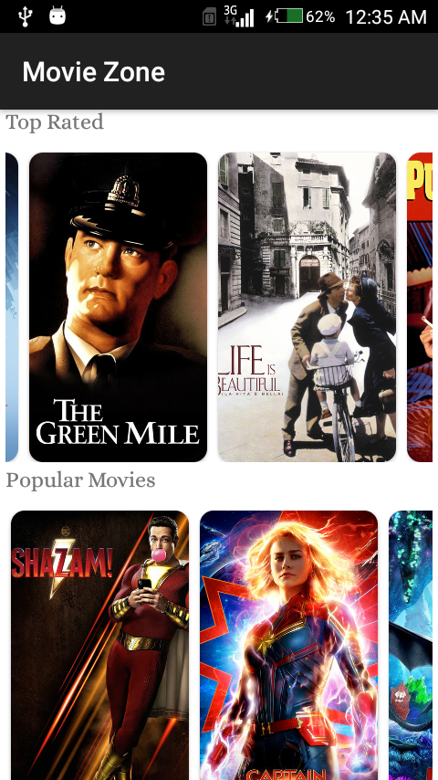
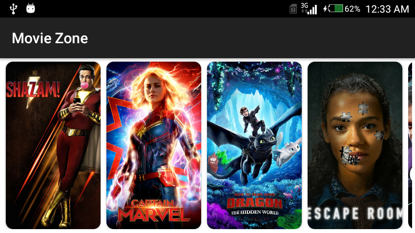
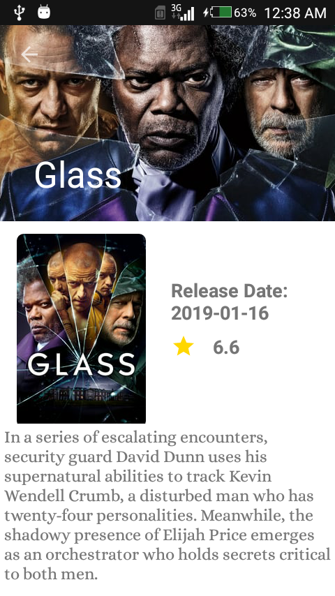

# Movie Zone

simple application to get movies list from [TheMovieDB](https://www.themoviedb.org/documentation/api)

Introduction
------------
simple movies application using  clean architecture , MVVM ,Repository pattern ,Architecture components

Screenshots
-----------

## Libraries Used

This module requires the following modules/libraries:

* [Kotlin](https://kotlinlang.org)
* [Androidx](https://developer.android.com/jetpack/androidx)
* [Android ViewModel](https://developer.android.com/topic/libraries/architecture/viewmodel)
* [Android LiveData](https://developer.android.com/topic/libraries/architecture/livedata)
* [MVVM architecture](https://developer.android.com/jetpack/docs/guide)
* [RxJava2](https://developer.android.com/jetpack/docs/guide)
* [Retrofit2](https://medium.com/mindorks/how-to-make-complex-requests-simple-with-rxjava-in-kotlin-ccec004c5d10)

## Installation

Install as usual,
* Clone this repo.
* Update your android studio to verion 3.3 .
* Happy coding.

## APK

[Releases page](https://drive.google.com/file/d/13TiovHB_ULy1Zz_DFKv4aZm0c4OFP1S9/view?usp=sharing)

